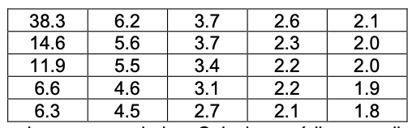

# Ex1

A tabela lista o número de casos de SIDA (em milhares) em 25 grandes cidades dos Estados Unidos durante o ano de 1992.

<p align="center">
  
</p>

Construa o histograma para descrever os dados. Calcule a média, a mediana, a amplitude e o desvio padrão. Qual a proporção de cidades com mais de 10 000 casos de SIDA em 1992?

1º temos que importar os dados, i.e, criar um vetor com os valores da tabela. Também podia ser usado um dataframe para isto.

```{r}
xValues = c(38.3,6.2,3.7,2.6,2.1,
            14.6,5.6,3.7,2.3,2.0,
            11.9,5.5,3.4,2.2,2.0,
            6.6,4.6,3.1,2.2,1.9,
            6.3,4.5,2.7,2.1,1.8)

xValues
```

2º Criar o histograma com os valores do vetor xValues.

```{r}
histograma = hist(xValues,
     include.lowest = TRUE, right = TRUE, fuzz = 1e-7,
     density = NULL, angle = 45, col = "lightgray", border = NULL,
     main = paste("Número de Casos de Sida em 25 cidades"),
     ylim = NULL,
     xlab = "Casos de sida", ylab = "Frequência",
     axes = TRUE, plot = TRUE, labels = FALSE,
     nclass = NULL, warn.unused = TRUE)
```

### Média
```{r}
media = mean(xValues)
media
```

### Mediana
```{r}
mediana = median(xValues)
mediana
```

### Amplitude 
Temos 2 vias para calcular a amplitude. Calculando o máximo e o mínimo e fazendo max-min. Ou utilizando o comando range()
```{r}

amplitude = max(xValues) - min(xValues)
ampl = range(xValues)

amplitude
ampl
```
### Desvio padrão 
```{r}
desvio_padrao = sd(xValues)
desvio_padrao
```

### Calcular proporção
Temos que calcular o nº de cidades com mais de 10000 casos logo:
```{r}
n_maior10000 = sum(xValues > 10)
n_maior10000
```
A seguir calculamos o nº total de cidades, neste caso 25:
```{r}
n_total = length(xValues)
n_total
```

A proporção é dada pelo nº de cidades com mais de 10000 casos a dividir pelo total de cidades:
```{r}
proporcao = n_maior10000/n_total
proporcao
```


# Ex2 


